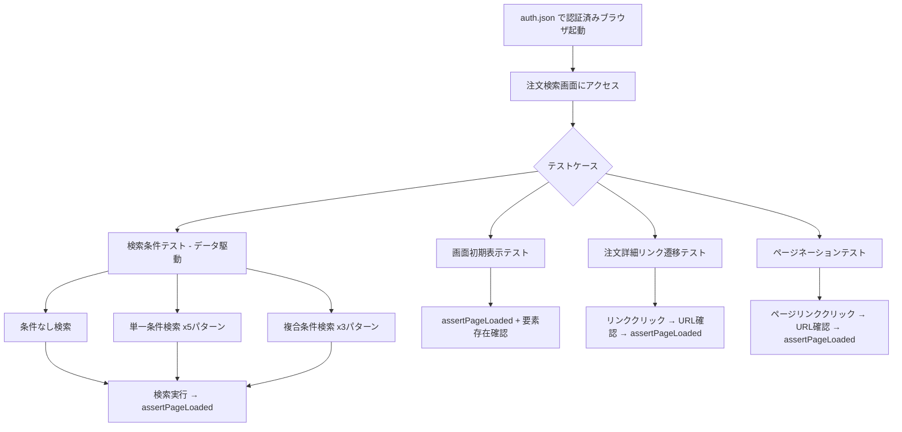

# 設計書: 注文検索画面（sales-list）E2Eテスト

## 概要

注文検索画面（`admin.php?page=sales-list`）のE2Eテストを、Playwright + TypeScriptで実装します。既存の10パターン検索テストを構造化し、保守性・可読性を向上させます。テストはデータ駆動アプローチを採用し、検索条件パターンを配列で定義することで、新しいパターンの追加・変更を容易にします。

## アーキテクチャ

### テスト構成

```
tests/tcs/sales-list.spec.ts    ← メインテストファイル（リファクタリング対象）
lib/test-helpers.ts              ← 既存の共通ヘルパー（変更なし）
```

### テスト実行フロー



## コンポーネントとインターフェース

### 検索条件パターン型定義

検索条件をデータ駆動で管理するための型を定義します。

```typescript
interface SearchCondition {
  name: string;                    // パターン名（テストレポート用）
  no?: string;                     // 注文番号テキスト
  customer_name?: string;          // 顧客名テキスト
  goods_name?: string;             // 商品名テキスト
  ship_addr?: string;              // 配送先テキスト
  lot?: string;                    // ロットテキスト
  car_model?: string;              // 車種 value
  status?: string;                 // ステータス value
  outgoing_warehouse?: string;     // 出庫倉庫 value
  delivery_s_dt?: string;          // 配送日開始
  delivery_e_dt?: string;          // 配送日終了
  arrival_s_dt?: string;           // 入庫日開始
  arrival_e_dt?: string;           // 入庫日終了
}
```

### 検索条件パターン定義

```typescript
const SEARCH_PATTERNS: SearchCondition[] = [
  { name: '条件なし' },
  { name: '車種のみ（6t-1）', car_model: '2' },
  { name: 'ステータスのみ（確定）', status: '1' },
  { name: 'ステータスのみ（未確定）', status: '0' },
  { name: '出庫倉庫のみ（内藤SP）', outgoing_warehouse: '1' },
  { name: '配送日のみ', delivery_s_dt: '2024-01-01', delivery_e_dt: '2025-12-31' },
  { name: '入庫日のみ', arrival_s_dt: '2024-01-01', arrival_e_dt: '2025-12-31' },
  { name: '注文番号テキスト入力', no: '1' },
  { name: '顧客名テキスト入力', customer_name: 'テスト顧客' },
  { name: '商品名テキスト入力', goods_name: 'テスト商品' },
  { name: '配送先テキスト入力', ship_addr: 'テスト配送先' },
  { name: 'ロットテキスト入力', lot: 'LOT001' },
  { name: '車種＋ステータス', car_model: '3', status: '1' },
  { name: '倉庫＋配送日', outgoing_warehouse: '2', delivery_s_dt: '2024-06-01', delivery_e_dt: '2025-06-30' },
  { name: '全条件指定', no: '1', customer_name: 'テスト', goods_name: 'テスト', ship_addr: 'テスト', lot: 'LOT',
    car_model: '2', status: '0', outgoing_warehouse: '1',
    delivery_s_dt: '2024-01-01', delivery_e_dt: '2025-12-31',
    arrival_s_dt: '2024-01-01', arrival_e_dt: '2025-12-31' },
];
```

### 検索実行ヘルパー関数

検索条件の設定と検索実行を共通化する関数です。

```typescript
async function executeSearch(page: Page, condition: SearchCondition): Promise<void> {
  await page.goto(PAGE_URL);
  await assertPageLoaded(page);

  // テキスト入力の設定
  if (condition.no) {
    await page.locator('input[name="s[no]"]').fill(condition.no);
  }
  if (condition.customer_name) {
    await page.locator('input[name="s[customer_name]"]').fill(condition.customer_name);
  }
  if (condition.goods_name) {
    await page.locator('input[name="s[goods_name]"]').fill(condition.goods_name);
  }
  if (condition.ship_addr) {
    await page.locator('input[name="s[ship_addr]"]').fill(condition.ship_addr);
  }
  if (condition.lot) {
    await page.locator('input[name="s[lot]"]').fill(condition.lot);
  }

  // セレクトボックスの設定
  if (condition.car_model) {
    await page.locator('select[name="s[car_model]"]').selectOption(condition.car_model);
  }
  if (condition.status) {
    await page.locator('select[name="s[status]"]').selectOption(condition.status);
  }
  if (condition.outgoing_warehouse) {
    await page.locator('select[name="s[outgoing_warehouse]"]').selectOption(condition.outgoing_warehouse);
  }

  // 日付入力の設定
  if (condition.delivery_s_dt) {
    await page.locator('input[name="s[delivery_s_dt]"]').fill(condition.delivery_s_dt);
  }
  if (condition.delivery_e_dt) {
    await page.locator('input[name="s[delivery_e_dt]"]').fill(condition.delivery_e_dt);
  }
  if (condition.arrival_s_dt) {
    await page.locator('input[name="s[arrival_s_dt]"]').fill(condition.arrival_s_dt);
  }
  if (condition.arrival_e_dt) {
    await page.locator('input[name="s[arrival_e_dt]"]').fill(condition.arrival_e_dt);
  }

  await wait(page);
  await page.locator('#wpbody-content input[value="検索"]').first().click();
  await wait(page);
  await assertPageLoaded(page);
}
```

### テスト構造

```typescript
test.describe('注文検索画面', () => {
  // 要件1: 画面初期表示
  test('画面が正常に表示され検索フォームの全要素が存在する', ...);

  // 要件2・3: 検索条件テスト（1テスト内で連続実行）
  test('各検索条件パターンで検索し結果が正常に表示される', ...);

  // 要件4: 注文詳細リンク遷移
  test('注文詳細リンクをクリックして遷移する', ...);

  // 要件5: ページネーション
  test('ページネーション（次のページ）をクリックして遷移する', ...);
});
```

## データモデル

### ロケーター定義

画面要素のロケーターを定数として一元管理します。

```typescript
const LOCATORS = {
  searchButton: '#wpbody-content input[value="検索"]',
  noInput: 'input[name="s[no]"]',
  customerNameInput: 'input[name="s[customer_name]"]',
  goodsNameInput: 'input[name="s[goods_name]"]',
  shipAddrInput: 'input[name="s[ship_addr]"]',
  lotInput: 'input[name="s[lot]"]',
  carModelSelect: 'select[name="s[car_model]"]',
  statusSelect: 'select[name="s[status]"]',
  warehouseSelect: 'select[name="s[outgoing_warehouse]"]',
  deliveryStartDate: 'input[name="s[delivery_s_dt]"]',
  deliveryEndDate: 'input[name="s[delivery_e_dt]"]',
  arrivalStartDate: 'input[name="s[arrival_s_dt]"]',
  arrivalEndDate: 'input[name="s[arrival_e_dt]"]',
  detailLink: '#wpbody-content a[href*="page=sales-detail"]',
  paginationPage2: '#wpbody-content a[href*="paged=2"]',
} as const;
```


## 正当性プロパティ

*プロパティとは、システムの全ての有効な実行において真であるべき特性や振る舞いのことです。プロパティは人間が読める仕様と機械で検証可能な正当性保証の橋渡しとなります。*

本テスト対象はWordPress管理画面のE2Eテストであり、テスト対象の入力はあらかじめ定義された検索条件パターンです。ランダム生成による入力の多様性は限定的であるため、プロパティベーステストではなく、データ駆動のexampleベーステストが適切です。

### Property 1: 検索パターンの網羅的実行

*全ての*定義済み検索条件パターン（`SEARCH_PATTERNS`配列の各要素）に対して、検索を実行した結果、ページがFatal errorやNot Foundを含まず正常に表示されること。

**Validates: Requirements 2.1, 2.2, 2.3, 2.4, 2.5, 2.6, 2.7, 2.8, 2.9, 2.10, 2.11, 2.12, 3.1, 3.2, 3.3**

### Property 2: 画面初期表示の完全性

注文検索画面にアクセスした場合、全ての検索フォーム要素（注文番号テキスト欄、顧客名テキスト欄、商品名テキスト欄、配送先テキスト欄、ロットテキスト欄、車種セレクト、ステータスセレクト、出庫倉庫セレクト、配送日入力欄×2、入庫日入力欄×2、検索ボタン）が表示されること。

**Validates: Requirements 1.1, 1.2, 1.3, 1.4**

### Property 3: 注文詳細画面への遷移整合性

検索結果内の注文詳細リンクをクリックした場合、URLが`page=sales-detail`を含む画面に遷移し、遷移先がエラーなく表示されること。

**Validates: Requirements 4.1, 4.2, 4.3**

### Property 4: ページネーション遷移整合性

ページネーションの2ページ目リンクをクリックした場合、URLが`paged=2`を含むページに遷移し、遷移先がエラーなく表示されること。

**Validates: Requirements 5.1, 5.2, 5.3**

## エラーハンドリング

### テスト対象画面のエラー検出

| エラー種別 | 検出方法 | 対応 |
|---|---|---|
| Fatal error | `assertPageLoaded`でbodyテキストを検証 | テスト失敗として報告 |
| Not Found | `assertPageLoaded`でbodyテキストを検証 | テスト失敗として報告 |
| 要素未表示 | `toBeVisible()`アサーション | テスト失敗として報告 |
| URL遷移失敗 | `waitForURL`のタイムアウト（10秒） | テスト失敗として報告 |

### テスト実行時のエラーハンドリング

| 状況 | 対応 |
|---|---|
| 注文詳細リンクが存在しない | `test.skip`でスキップし理由を報告 |
| ページネーションが存在しない | `test.skip`でスキップし理由を報告 |
| 認証切れ | `check-auth.ts`のglobalSetupで事前検出し、テスト実行前にエラー終了 |

## テスト戦略

### テスト構成

本E2Eテストは以下の4つのテストケースで構成します。

| テストケース | テスト種別 | 対応要件 |
|---|---|---|
| 画面初期表示テスト | example | 要件1 |
| 検索条件パターンテスト（データ駆動） | example（データ駆動） | 要件2, 3 |
| 注文詳細リンク遷移テスト | example | 要件4 |
| ページネーションテスト | example | 要件5 |

### データ駆動テストによる改善

既存の10パターン検索テストは、各パターンのコードが重複しており保守性が低い状態です。改善として：

- 検索条件を`SearchCondition`型の配列（`SEARCH_PATTERNS`）として定義
- テキスト入力欄（注文番号、顧客名、商品名、配送先、ロット）のパターンを追加し15パターンに拡充
- 共通の`executeSearch`関数で検索実行ロジックを一元化
- `for...of`ループで全パターンを連続実行
- パターンの追加・変更は配列への要素追加・変更のみで対応可能

### テスト実行方針

- 検索条件テストは1つの`test`ブロック内で`for...of`ループにより連続実行（要件6.5）
- 各アクション後に`wait(page)`で3秒待機（要件6.2）
- `assertPageLoaded(page)`で全ページ遷移後の正常性を検証（要件6.3）
- テストタイムアウトは300秒（5分）に設定（15パターン × 約20秒）

### テストフレームワーク

- Playwright Test（`@playwright/test`）
- TypeScript
- 既存ヘルパー: `lib/test-helpers.ts`の`assertPageLoaded`と`wait`を使用
